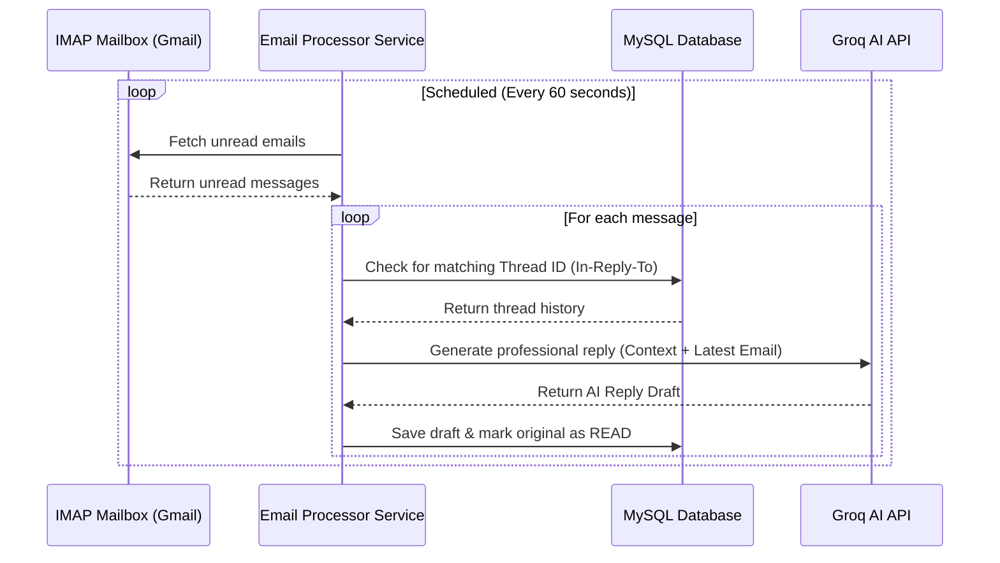
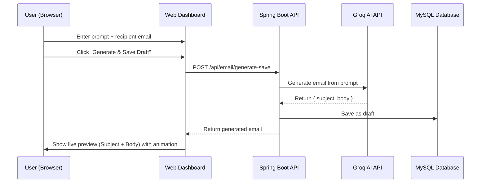

# AI-Powered Email Agent 🤖✉️

An intelligent, full-stack email automation assistant built with **Spring Boot** and integrated with **Groq (Llama-3.3-70b-versatile)**. The application features a sleek **web dashboard UI**, monitors an email inbox via IMAP, automatically drafts AI-powered replies based on conversational context, saves them to a database for human review, and enables manual or automated sending — all from a single, beautiful interface.

---

## 🚀 Key Features

- **🎨 Interactive Web Dashboard** — A modern dark-themed UI to manage the entire email workflow from one place.
- **🤖 AI Email Generator** — Describe what you want to write; the AI generates a professional email instantly and saves it as a draft. The generated email is previewed live in the Output Preview panel.
- **📬 Automated Inbox Polling** — Listens to an IMAP-enabled Gmail inbox every 60 seconds for new unread emails.
- **🧵 Context-Aware AI Replies** — Groq (Llama 3.3) reads the full thread history before drafting a reply, preserving conversational context.
- **✏️ Draft Refinement** — Refine any saved draft using plain-English AI instructions (e.g. *"Make it shorter and more formal"*).
- **📤 SMTP Email Delivery** — Dispatches emails with correct threading headers (`In-Reply-To`, `Message-ID`) for proper inbox threading.
- **📜 Sent History** — Full searchable log of every email sent through the agent.
- **📖 Swagger / OpenAPI** — Interactive API documentation generated automatically at runtime.

---

## 🖥️ Web Dashboard UI

The frontend is a single-page application served directly from Spring Boot (`/static`). It includes four tabs:

| Tab | Description |
|-----|-------------|
| **Dashboard** | Live metrics (emails sent, active drafts) + recent activity table + quick-action shortcuts |
| **AI Generator** | Enter a prompt and recipient → click **Generate & Save Draft** → generated email previews instantly on the right |
| **Drafts Manager** | Browse all saved drafts, open any draft to edit, refine with AI, or send directly |
| **Sent Emails** | Searchable table of all dispatched emails with timestamps |

---

## 🛠️ System Workflow

### Automated Reply Loop (Background)


### Manual AI Generator Flow (UI)


---

## 💻 Tech Stack

| Layer | Technology |
|-------|-----------|
| **Backend Framework** | Spring Boot 4.0.6 (WebMVC, Data JPA, Mail) |
| **Language** | Java 17+ |
| **AI Provider** | Groq API — `llama-3.3-70b-versatile` |
| **Database** | MySQL |
| **Frontend** | Vanilla HTML5 + CSS3 + JavaScript (no framework) |
| **Email Protocol** | SMTP (send) + IMAP (receive) via Gmail |
| **API Docs** | SpringDoc OpenAPI / Swagger UI v3.0.3 |
| **Build Tool** | Maven |

---

## 📁 Project Structure

```text
AutomateEmailSenderAgent/
├── src/
│   ├── main/
│   │   ├── java/com/example/AutomateEmailSenderAgent/
│   │   │   ├── config/
│   │   │   │   ├── AppConfig.java            # RestTemplate & beans
│   │   │   │   └── CustomAPI.java            # Groq API config
│   │   │   ├── controller/
│   │   │   │   └── UserController.java       # All REST endpoints
│   │   │   ├── dto/
│   │   │   │   ├── ConversationResponse.java
│   │   │   │   ├── GenerateAndSaveRequest.java
│   │   │   │   ├── GenerateEmailRequest.java
│   │   │   │   ├── GenerateEmailResponse.java
│   │   │   │   ├── GenerateReplyRequest.java
│   │   │   │   ├── GenerateReplyResponse.java
│   │   │   │   ├── RefineDraftRequest.java
│   │   │   │   ├── SendDraftRequest.java
│   │   │   │   └── SendEmailRequest.java
│   │   │   ├── model/
│   │   │   │   └── Conversation.java         # JPA entity (email records)
│   │   │   ├── repository/
│   │   │   │   └── ConversationRepository.java
│   │   │   ├── service/
│   │   │   │   ├── AiEmailWriterService.java # Groq API integration
│   │   │   │   ├── ConversationService.java  # Core business logic
│   │   │   │   ├── EmailListenerService.java # IMAP polling scheduler
│   │   │   │   ├── EmailProcessorService.java# Parses & routes inbound mail
│   │   │   │   └── EmailSenderService.java   # SMTP sending
│   │   │   └── AutomateEmailSenderAgentApplication.java
│   │   └── resources/
│   │       ├── static/
│   │       │   ├── index.html                # Single-page web dashboard
│   │       │   ├── style.css                 # Dark theme UI styles
│   │       │   └── app.js                    # Frontend logic & API calls
│   │       └── application.properties
│   └── test/
├── pom.xml
├── mvnw / mvnw.cmd
└── README.md
```

---

## ⚙️ Configuration Setup

Update `src/main/resources/application.properties` with your credentials. Use environment variables to avoid committing secrets:

```properties
# --- MySQL Database ---
spring.datasource.url=jdbc:mysql://localhost:3306/automateemail
spring.datasource.username=root
spring.datasource.password=${DB_PASSWORD:your_db_password}
spring.jpa.hibernate.ddl-auto=update

# --- Gmail SMTP (Sending) ---
spring.mail.host=smtp.gmail.com
spring.mail.port=587
spring.mail.username=${MAIL_USERNAME:your_email@gmail.com}
spring.mail.password=${MAIL_PASSWORD:your_app_password}
spring.mail.properties.mail.smtp.auth=true
spring.mail.properties.mail.smtp.starttls.enable=true

# --- Gmail IMAP (Reading) ---
imap.host=imap.gmail.com
imap.port=993
imap.username=${MAIL_USERNAME:your_email@gmail.com}
imap.password=${MAIL_PASSWORD:your_app_password}

# --- Groq AI API ---
groq.api.key=${GROQ_API_KEY:your_groq_api_key}
groq.api.url=https://api.groq.com/openai/v1/chat/completions
```

> **Gmail Setup**: Enable **2-Step Verification** and generate an **App Password** at [myaccount.google.com/apppasswords](https://myaccount.google.com/apppasswords). Use this as your `MAIL_PASSWORD`.

---

## 🏃 Running the Project

1. **Create the MySQL database**:
   ```sql
   CREATE DATABASE automateemail;
   ```

2. **Build the application**:
   ```bash
   ./mvnw clean compile
   ```

3. **Run the application**:
   ```bash
   ./mvnw spring-boot:run
   ```

4. **Open the dashboard** in your browser:
   ```
   http://localhost:8080
   ```

5. **View API docs** (Swagger UI):
   ```
   http://localhost:8080/swagger-ui/index.html
   ```

---

## 🔌 API Endpoints Reference

### 📧 Email Operations
| Method | Endpoint | Description |
|--------|----------|-------------|
| `POST` | `/api/email/send` | Send a new email immediately |
| `GET` | `/api/email/sent` | Get all sent emails |

```json
// POST /api/email/send — Request Body
{
  "to": "customer@example.com",
  "subject": "Project Update",
  "body": "Hello, here is the latest update...",
  "threadId": "optional-thread-uuid"
}
```

### 📝 Drafts Operations
| Method | Endpoint | Description |
|--------|----------|-------------|
| `GET` | `/api/email/drafts` | Fetch all saved drafts |
| `POST` | `/api/email/generate-save` | Generate email via AI and save as draft |
| `POST` | `/api/email/draft/save-custom` | Save a manually written draft |
| `POST` | `/api/email/draft/send` | Dispatch a draft by its ID |
| `POST` | `/api/email/draft/refine` | Refine a draft with AI instructions |
| `DELETE` | `/api/email/draft/{id}` | Delete a specific draft |

```json
// POST /api/email/generate-save — Request Body
{
  "prompt": "Write a polite follow-up email about project proposal feedback",
  "email": "client@example.com"
}

// POST /api/email/draft/refine — Request Body
{
  "draftId": 12,
  "instructions": "Make the tone warmer and add a discount code: SAVE10"
}
```

### 🧠 AI & Conversation History
| Method | Endpoint | Description |
|--------|----------|-------------|
| `POST` | `/api/email/generate` | Generate an email from a prompt (no save) |
| `GET` | `/api/email/conversations/{email}` | Full thread history for an email address |
| `GET` | `/api/email/thread/{threadId}` | All messages in a specific thread |
| `POST` | `/api/email/generate-reply` | AI-generated reply for a thread using context |

---

## 📖 Swagger Documentation

Interactive API docs are auto-generated at startup:

👉 **[http://localhost:8080/swagger-ui/index.html](http://localhost:8080/swagger-ui/index.html)**

---

## 👤 Author

**Sudhanshu Chauhan**
- 📧 [sudhanshuchauhan6789@gmail.com](mailto:sudhanshuchauhan6789@gmail.com)
- 🐙 [github.com/sudhanshu-chauhan18](https://github.com/sudhanshu-chauhan18)

---

## 📄 License

This project is open-source and available under the [MIT License](LICENSE).
