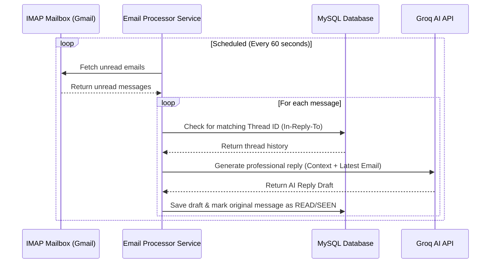

# AutomateEmailSenderAgent 🤖✉️

An intelligent, AI-powered email assistant built using **Spring Boot 4** and integrated with **Groq (Llama-3.3-70b-versatile)**. The application monitors an email inbox (via IMAP), automatically drafts professional replies based on conversational context, saves them to a database for review, and enables manual or automated sending.

---

## 🚀 Key Features

*   **Automated Email Polling**: Listens to an IMAP-enabled inbox periodically for unread emails.
*   **Context-Aware AI Replies**: Connects to the Groq API using Llama 3.3 to write contextual email drafts preserving thread history.
*   **Draft Refinement**: Refine and rewrite generated drafts dynamically using custom prompt instructions through REST endpoints.
*   **SMTP Email Delivery**: Sends out refined responses under correct email threading headers (`In-Reply-To`, `Message-ID`).
*   **OpenAPI / Swagger Integration**: Easily view and test all REST endpoints via an interactive Swagger UI.

---

## 🛠️ System Workflow

The diagram below demonstrates the automated loop of email processing:



---

## 💻 Tech Stack

*   **Framework**: Spring Boot 4.0.6 (Spring WebMVC, Spring Data JPA)
*   **Java Version**: Java 17+ (Tested up to Java 25)
*   **Database**: MySQL Database
*   **AI Integration**: Groq API (`llama-3.3-70b-versatile`)
*   **Documentation**: SpringDoc OpenAPI UI v3.0.3
*   **Build Tool**: Maven

---

## 📁 Project Structure

```text
AutomateEmailSenderAgent/
├── .mvn/
│   └── wrapper/
│       └── maven-wrapper.properties
├── src/
│   ├── main/
│   │   ├── java/
│   │   │   └── com/
│   │   │       └── example/
│   │   │           └── AutomateEmailSenderAgent/
│   │   │               ├── config/
│   │   │               │   ├── AppConfig.java
│   │   │               │   └── CustomAPI.java
│   │   │               ├── controller/
│   │   │               │   └── UserController.java
│   │   │               ├── dto/
│   │   │               │   ├── ConversationResponse.java
│   │   │               │   ├── GenerateAndSaveRequest.java
│   │   │               │   ├── GenerateEmailRequest.java
│   │   │               │   ├── GenerateEmailResponse.java
│   │   │               │   ├── GenerateReplyRequest.java
│   │   │               │   ├── GenerateReplyResponse.java
│   │   │               │   ├── RefineDraftRequest.java
│   │   │               │   ├── SendDraftRequest.java
│   │   │               │   └── SendEmailRequest.java
│   │   │               ├── model/
│   │   │               │   └── Conversation.java
│   │   │               ├── repository/
│   │   │               │   └── ConversationRepository.java
│   │   │               ├── service/
│   │   │               │   ├── AiEmailWriterService.java
│   │   │               │   ├── ConversationService.java
│   │   │               │   ├── EmailListenerService.java
│   │   │               │   ├── EmailProcessorService.java
│   │   │               │   └── EmailSenderService.java
│   │   │               └── AutomateEmailSenderAgentApplication.java
│   │   └── resources/
│   │       ├── static/
│   │       ├── templates/
│   │       └── application.properties
│   └── test/
│       └── java/
│           └── com/
│               └── example/
│                   └── AutomateEmailSenderAgent/
│                       └── AutomateEmailSenderAgentApplicationTests.java
├── .gitattributes
├── .gitignore
├── HELP.md
├── mvnw
├── mvnw.cmd
├── pom.xml
└── README.md
```

---

## ⚙️ Configuration Setup

Rename or update [application.properties](file:///e:/JavaWithSD/springboot/AutomateEmailSenderAgent/src/main/resources/application.properties) with your settings. To prevent committing sensitive credentials, it is recommended to use environment variables:

```properties
# --- MySQL Database Configuration ---
spring.datasource.url=jdbc:mysql://localhost:3306/automateemail
spring.datasource.username=root
spring.datasource.password=${DB_PASSWORD:your_db_password}
spring.jpa.hibernate.ddl-auto=update

# --- Email SMTP (Sending Settings) ---
spring.mail.host=smtp.gmail.com
spring.mail.port=587
spring.mail.username=${MAIL_USERNAME:your_email@gmail.com}
spring.mail.password=${MAIL_PASSWORD:your_app_password}
spring.mail.properties.mail.smtp.auth=true
spring.mail.properties.mail.smtp.starttls.enable=true

# --- Email IMAP (Reading Settings) ---
imap.host=imap.gmail.com
imap.port=993
imap.username=${MAIL_USERNAME:your_email@gmail.com}
imap.password=${MAIL_PASSWORD:your_app_password}

# --- Groq AI API Configuration ---
groq.api.key=${GROQ_API_KEY:your_groq_api_key}
groq.api.url=https://api.groq.com/openai/v1/chat/completions
```

---

## 🏃 Running the Project

1. **Database Setup**: Ensure MySQL is running and create the schema `automateemail`:
   ```sql
   CREATE DATABASE automateemail;
   ```
2. **Build the Application**:
   ```bash
   ./mvnw clean compile
   ```
3. **Run the Application**:
   ```bash
   ./mvnw spring-boot:run
   ```
4. **Run Tests**:
   ```bash
   ./mvnw test
   ```

---

## 🔌 API Endpoints Reference

### 📧 Email Operations
*   `POST /api/email/send` — Manually send a new email and save the record.
    ```json
    {
      "to": "customer@example.com",
      "subject": "Inquiry Reply",
      "body": "Hello, how can I help you?",
      "threadId": "optional-uuid"
    }
    ```
*   `GET /api/email/sent` — Retrieves all sent emails.

### 📝 Drafts Operations
*   `GET /api/email/drafts` — Fetch all generated email drafts.
*   `POST /api/email/generate-save` — Ask the AI to write an email and save it directly as a draft.
*   `POST /api/email/draft/send` — Confirm and dispatch a draft email by its ID.
*   `DELETE /api/email/draft/{id}` — Delete a specific draft.
*   `POST /api/email/draft/refine` — Instructions-based draft refinement.
    ```json
    {
      "draftId": 12,
      "instructions": "Make the tone warmer and append a discount code: SAVE10"
    }
    ```

### 🧠 AI & Conversation History
*   `GET /api/email/conversations/{email}` — Retrieves all thread history for a customer's email.
*   `GET /api/email/thread/{threadId}` — Retrieves logs belonging to a single conversation thread.
*   `POST /api/email/generate-reply` — Request AI to draft a reply for a specific thread using conversational context.

---

## 📖 Swagger Documentation

Interactive API specs are generated at startup. You can test and view full payload schemas by visiting:
👉 **[http://localhost:8080/swagger-ui/index.html](http://localhost:8080/swagger-ui/index.html)**

---

## 👥 Author

*   **Sudhanshu Chauhan** — [sudhanshuchauhan6789@gmail.com](mailto:sudhanshuchauhan6789@gmail.com)
